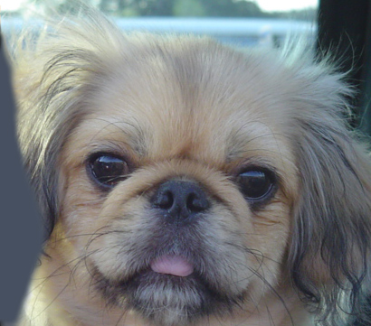

    
     
    Look at the image from very close, then from far away.
      

# Project 1: Image Filtering and Hybrid Images

## Brief
* Due: 9/9/2019 11:59PM
* Project materials including writeup template [proj1_v2.zip](projects/proj1_v2.zip)
* Hand-in: through [Canvas](https://gatech.instructure.com)
* Required files: `<your_gt_username>.zip`, `<your_gt_username>_proj1.pdf`

## Overview
The goal of this assignment is to write an image filtering function and use it to create hybrid images using a simplified version of the SIGGRAPH 2006 [paper](misc/oliva-siggraph-2006.pdf) by Oliva, Torralba, and Schyns. _Hybrid images_ are static images that change in interpretation as a function of the viewing distance. The basic idea is that high frequency tends to dominate perception when it is available but, at a distance, only the low frequency (smooth) part of the signal can be seen. By blending the high frequency portion of one image with the low-frequency portion of another, you get a hybrid image that leads to different interpretations at different distances.

This project is intended to familiarize you with Python, PyTorch, and image filtering. Once you have created an image filtering function, it is relatively straightforward to construct hybrid images. If you don't already know Python, you may find [this resource](https://docs.python.org/3/tutorial/) helpful. If you are more familiar with MATLAB, [this guide](http://mathesaurus.sourceforge.net/matlab-numpy.html) is very helpful. If you're unfamiliar with PyTorch, the [tutorials](https://pytorch.org/tutorials/) from the official website are useful.

## Setup
1. Install [Miniconda](https://conda.io/miniconda.html). It doesn't matter whether you use Python 2 or 3 because we will create our own environment that uses 3 anyways.
2. Create a conda environment using the appropriate command. On Windows, open the installed "Conda prompt" to run the command. On MacOS and Linux, you can just use a terminal window to run the command, Modify the command based on your OS (`linux`, `mac`, or `win`): `conda env create -f proj1_env_<OS>.yml`
3. This should create an environment named 'proj1'. Activate it using the Windows command, `activate proj1` or the MacOS / Linux command, `source activate proj1`
4. Install the project package, by running `pip install -e .` inside the repo folder.
5. Run the notebook using `jupyter notebook ./proj1_code/proj1.ipynb`
6. Ensure that all sanity checks are passing by running `pytest tests` inside the repo folder.
7. Generate the zip folder for the code portion of your submission once you've finished the project using `python zip_submission.py --gt_username <your_gt_username>` (don't forget to submit your report, too!).

## Part 1: NumPy

**Gaussian Kernels.** Gaussian filters are used for blurring images. You will be implementing `create_Gaussian_kernel()` that creates a 2D Gaussian kernel according to a free parameter, _cutoff frequency_, which controls how much low frequency to leave in the image. This is an important step for later in the project when you create hybrid images!

The multivariate Gaussian function is defined as:

$$p(x;\mu, \Sigma) = \frac{1}{(2\pi)^{n/2}\det(\Sigma)^{1/2}}\exp\bigg(-\frac{1}{2}(x-\mu)^\top\Sigma^{-1}(x-\mu)\bigg)$$

where $$n$$ is equal to the dimension of $$x$$, $$\mu$$ is the mean, and $$\Sigma$$ is the covariance matrix. Alternatively, you can create a 2D Gaussian by taking the outer product of two vectors. Each such vector should have values populated from evaluating the 1D Gaussian PDF at each coordinate. The 1D Gaussian is defined as:

$$p(x; \mu, \sigma^2) = \frac{1}{\sqrt{2\pi}\sigma} \mbox{exp} \Bigg(-\frac{1}{2\sigma^2}(x-\mu)^2 \Bigg)$$

In your implementation, you will use the value of cutoff frequency to define the size, mean, and variance of the Gaussian kernel. Specifically, the kernel $$G$$ should be size $$(k, k)$$ where $$k=4\cdot\text{cutoff_frequency}+1$$, have mean $$\mu=\lfloor\frac{k}{2}\rfloor$$, standard deviation $$\sigma=\text{cutoff_frequency}$$, and values that sum to 1 (i.e. $$\sum_{ij}\alpha G_{ij}=1$$ where $$\alpha$$ is some constant scale factor).

**Image Filtering.** Image filtering (or convolution) is a fundamental image processing tool. See chapter 3.2 of Szeliski and the lecture materials to learn about image filtering (specifically linear filtering). You will be writing your own function to implement image filtering from scratch. More specifically, you will implement `my_imfilter()` which imitates the `filter2D()` function in the OpenCV library. As specified in `part1.py`, your filtering algorithm must: (1) support grayscale and color images, (2) support arbitrarily-shaped filters, as long as both dimensions are odd (e.g. 7x9 filters, but not 4x5 filters), (3) pad the input image with zeros or reflected image content, and (4) return a filtered image which is the same resolution as the input image. We have provided an iPython notebook, `proj1_test_filtering.ipynb`, along with some tests (which are called in `proj1.ipynb`) to help you debug your image filtering algorithm. Note that there is a time limit of 5 minutes for a single call to `my_imfilter()`, so try to optimize your implementation if it goes over.

**Hybrid Images.** A hybrid image is the sum of a low-pass filtered version of one image and a high-pass filtered version of another image. As mentioned in above, _cutoff frequency_ controls how much high frequency to leave in one image and how much low frequency to leave in the other image. In `cutoff_frequencies.txt`, we provide a default value of 7 for each pair of images (the value on line _i_ corresponds to the cutoff frequency value for the _i_-th image pair). You should replace these values with the ones you find work best for each image pair. In the paper it is suggested to use two cutoff frequencies (one tuned for each image) and you are free to try that as well. In the starter code, the cutoff frequency is controlled by changing the standard deviation of the Gaussian filter used in constructing the hybrid images. You will first implement `create_hybrid_image()` according to the starter code in `part1.py`. Your function will call `my_imfilter()` using the kernel generated from `create_Gaussian_kernel()` to create low and high frequency images and then combine them into a hybrid image.

## Part 2: PyTorch

**Dataloader.** You will now implement creating hybrid images again but using PyTorch. The `HybridImageDataset` class in `datasets.py` will create tuples using pairs of images with a corresponding cutoff frequency (which you should have found from experimenting in Part 1). The images will be loaded from `data/` and the cutoff frequencies from `cutoff_frequencies.txt`. Refer to [this tutorial](https://pytorch.org/tutorials/beginner/data_loading_tutorial.html) for additional information on data loading & processing.

**Model.** Next, you will implement the `HybridImageModel` class in `models.py`. Instead of using your implementation of `my_imfilter()` to get the low and high frequencies from a pair of images, `low_pass()` should use the 2d convolution operator from `torch.nn.functional` to apply a low pass filter to a given image. You will have to implement `get_kernel()` which calls your `create_Gaussian_kernel()` function from `part1.py` for each pair of images using the cutoff_frequencies as specified in `cutoff_frequencies.txt` and reshapes it to the appropriate dimensions for PyTorch. Then, similar to `create_hybrid_image()` from Part 1, `forward()` will call `get_kernel()` and `low_pass()` to create the low and high frequency images and combine them into a hybrid image. Refer to [this tutorial](https://pytorch.org/tutorials/beginner/blitz/neural_networks_tutorial.html) for additional information on defining neural networks using PyTorch.

Lastly, you will compare the runtimes of your hybrid image implementations from Parts 1 and 2.

## Data

We provide you with 5 pairs of aligned images which can be merged reasonably well into hybrid images. The alignment is super important because it affects the perceptual grouping (read the paper for details). We encourage you to create additional examples (e.g. change of expression, morph between different objects, change over time, etc.).

For the example shown at the top of the page, the two original images look like this:

    
    
      

The low-pass (blurred) and high-pass versions of these images look like this:

    
    
      

The high frequency image is actually zero-mean with negative values, so it is visualized by adding 0.5. In the resulting visualization, bright values are positive and dark values are negative.

Adding the high and low frequencies together gives you the image at the top of this page. If you're having trouble seeing the multiple interpretations of the image, a useful way to visualize the effect is by progressively downsampling the hybrid image as is done below:

    
      

The starter code provides a function, `vis_image_scales_numpy()` in `utils.py`, which can be used to save and display such visualizations.

**Potentially useful NumPy (Python library) functions**: `np.pad()`, which does many kinds of image padding for you, `np.clip()`, which "clips" out any values in an array outside of a specified range, `np.sum()` and `np.multiply()`, which makes it efficient to do the convolution (dot product) between the filter and windows of the image. Documentation for NumPy can be found [here](https://docs.scipy.org/doc/numpy/) or by Googling the function in question.

**Forbidden functions** (you can use these for testing, but not in your final code): anything that takes care of the filtering operation or creates a 2D Gaussian kernel directly for you. If it feels like you're sidestepping the work, then it's probably not allowed. Ask the TAs if you have any doubts.

**Editing code**: You can use any method you want to edit the Python files. You may use a simple text editor like [Sublime Text](https://www.sublimetext.com/3), an IDE like [PyCharm](https://www.jetbrains.com/pycharm/), or even just editing the code in your browser from the iPython notebook homepage. Google "Python editor" to find a litany of additional suggestions.

## Testing
We have provided a set of tests for you to evaluate your implementation. We have included tests inside `proj1.ipynb` so you can check your progress as you implement each section. When you're done with the entire project, you can call additional tests by running `pytest tests` inside the root directory of the project. _Your grade on the coding portion of the project will be further evaluated with a set of tests not provided to you._

## Bells & Whistles (Extra Points)
For later projects there will be more concrete extra credit suggestions. It is possible to get extra credit for this project as well if you come up with some clever extensions which impress the TAs. If you choose to do extra credit, make sure to include `README.txt` which briefly explains what you did, and how the TAs can run your code. Additionally, you should add slides _at the end_ of your report further explaining your implementation, results, and analysis. You will not be awarded credit if these two components (README and slides) are missing from your submission.

## Writeup
For this project (and all other projects), you must do a project report using the template slides provided to you. Do <u>not</u> change the order of the slides or remove any slides, as this will affect the grading process on Gradescope and you will be deducted points. In the report you will describe your algorithm and any decisions you made to write your algorithm a particular way. Then you will show and discuss the results of your algorithm. The template slides provide guidance for what you should include in your report. A good writeup doesn't just show results--it tries to draw some conclusions from the experiments. You must convert the slide deck into a PDF for your submission.

If you choose to do anything extra, add slides _after the slides given in the template deck_ to describe your implementation, results, and analysis. Adding slides in between the report template will cause issues with Gradescope, and you will be deducted points. You will not receive full credit for your extra credit implementations if they are not described adequately in your writeup.

## Rubric
* +5 pts: `create_Gaussian_kernel()` in `part1.py`
* +20 pts: `my_imfilter()` in `part1.py`
* +10 pts: `create_hybrid_image()` in `part1.py`
* +10 pts: `make_dataset()` in `datasets.py`
* +5 pts: `get_cutoff_frequencies()` in `datasets.py`
* +5 pts: `__len__()` in `datasets.py`
* +5 pts: `__getitem__()` in `datasets.py`
* +5 pts: `get_kernel()` in `models.py`
* +5 pts: `low_pass()` in `models.py`
* +10 pts: `forward()` in `models.py`
* +20 pts: Report with several examples of hybrid images
* -5\*n pts: Lose 5 points for every time you do not follow the instructions for the hand-in format.

## Submission Format
This is very important as you will lose 5 points for every time you do not follow the instructions. You will attach two items in your submission on Canvas:

1. `<your_gt_username>.zip` containing:
    * `proj1_code/` - directory containing all your code for this assignment
    * `cutoff_frequencies.txt` - .txt file containing the best cutoff frequency values you found for each pair of images in `data/`.
    * `additional_data/` - (optional) if you use any data other than the images we provide you, please include them here
    * `README.txt` - (optional) if you implement any new functions other than the ones we define in the skeleton code (e.g. any extra credit implementations), please describe what you did and how we can run the code. We will not award any extra credit if we can't run your code and verify the results.
2. `<your_gt_username>_proj1.pdf` - your report

Do <u>not</u> install any additional packages inside the conda environment. The TAs will use the same environment as defined in the config files we provide you, so anything that's not in there by default will probably cause your code to break during grading. Do <u>not</u> use absolute paths in your code or your code will break. Use relative paths like the starter code already does. Failure to follow any of these instructions will lead to point deductions. Create the zip file using `python zip_submission.py --gt_username <your_gt_username>` (it will zip up the appropriate directories/files for you!) and hand it in with your PDF through Canvas.

## Credits
Assignment developed by Cusuh Ham, John Lambert, Samarth Brahmbhatt, Frank Dellaert, and James Hays based on a similar project by Derek Hoiem.
