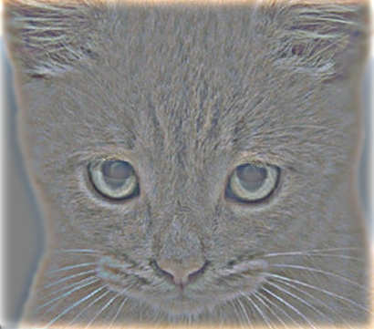

    
     
    Look at the image from very close, then from far away.
      

# Project 1: Image Filtering and Hybrid Images

## Brief
* Due: 9/9/2019 11:59PM
* Project materials including writeup template [proj1.zip]()
* Hand-in: through [Canvas](https://gatech.instructure.com)
* Required files: proj1.zip (code/, results/), report.pdf

## Overview
The goal of this assignment is to write an image filtering function and use it to create [hybrid images](http://cvcl.mit.edu/hybrid_gallery/gallery.html) using a simplified version of the SIGGRAPH 2006 [paper](http://cvcl.mit.edu/publications/OlivaTorralb_Hybrid_Siggraph06.pdf) by Oliva, Torralba, and Schyns. _Hybrid images_ are static images that change in interpretation as a function of the viewing distance. The basic idea is that high frequency tends to dominate perception when it is available but, at a distance, only the low frequency (smooth) part of the signal can be seen. By blending the high frequency portion of one image with the low-frequency portion of another, you get a hybrid image that leads to different interpretations at different distances.

This project is intended to familiarize you with Python, Pytorch, and image filtering. Once you have created an image filtering function, it is relatively straightforward to construct hybrid images. If you don't already know Python, you may find [this resource](https://docs.python.org/3/tutorial/) helpful. If you are more familiar with MATLAB, [this guide](http://mathesaurus.sourceforge.net/matlab-numpy.html) is very helpful. If you're unfamiliar with PyTorch, the [tutorials](https://pytorch.org/tutorials/) from the official website are useful.

## Setup
1. Install [Miniconda](https://conda.io/miniconda.html). It doesn't matter whether you use Python 2 or 3 because we will create our own environment that uses 3 anyways.
2. Create a conda environment using the appropriate command. On Windows, open the installed "Conda prompt" to run the command. On MacOS and Linux, you can just use a terminal window to run the command, Modify the command based on your OS (`linux`, `mac`, or `win`): `conda env create -f environment_<OS>.yml`
3. This should create an environment named 'cs4476'. Activate it using the Windows command, `activate cs4476` or the MacOS / Linux command, `source activate cs4476`
4. Run the notebook using `jupyter notebook ./code/proj1.ipynb`
5. Generate the zip folder for the code portion of your submission once you've finished the project using `python zip_submission.py` (don't forget to submit your report, too!).

## Part 1: NumPy

**Image Filtering.** Image filtering (or convolution) is a fundamental image processing tool. See chapter 3.2 of Szeliski and the lecture materials to learn about image filtering (specifically linear filtering). You will be writing your own function to implement image filtering from scratch. More specifically, you will implement `my_imfilter()` which imitates the `filter2D()` function in the OpenCV library. As specified in `student_code.py`, your filtering algorithm must: (1) support grayscale and color images, (2) support arbitrarily-shaped filters, as long as both dimensions are odd (e.g. 7x9 filters, but not 4x5 filters), (3) pad the input image with zeros or reflected image content, and (4) return a filtered image which is the same resolution as the input image. We have provided an iPython notebook, `proj1_test_filtering.ipynb`, to help you debug your image filtering algorithm.

**Hybrid Images.** A hybrid image is the sum of a low-pass filtered version of one image and a high-pass filtered version of another image. There is a free parameter, _cutoff frequency_, that controls _how much_ high frequency to remove from the first image and how much low frequency to leave in the second image. This value can be tuned for each image pair. In `cutoff_frequencies.txt` under `data/`, we provide a default value of 7 for each pair of images (the value on line _i_ corresponds to the cutoff frequency value for the _i_-th image pair). You should replace these values with the ones you find work best for each image pair. In the paper it is suggested to use two cutoff frequencies (one tuned for each image) and you are free to try that as well. In the starter code, the cutoff frequency is controlled by changing the standard deviation of the Gaussian filter used in constructing the hybrid images. You will first implement `create_hybrid_image()` according to the starter code in `student_code.py`. Your function will call `my_imfilter()` to create low and high frequency images and then combine them into a hybrid image.

## Part 2: PyTorch

**Dataloader.** You will now implement creating hybrid images again but using PyTorch. The `HybridImageDataset` class in `datasets.py` will create tuples using pairs of images with a corresponding cutoff frequency (which you should have found from experimenting in Part 1). The images will be loaded from `data/` and the cutoff frequencies from `data/cutoff_frequencies.txt`. Refer to [this tutorial](https://pytorch.org/tutorials/beginner/data_loading_tutorial.html) for additional information on data loading & processing.

**Model.** Next, you will implement the `HybridImageModel` class in `models.py`. Instead of using your implementation of `my_imfilter()` to get the low and high frequencies from a pair of images, `low_pass()` should use the 2d convolution operator from `torch.nn.functional` to apply a low pass filter to a given image. `forward()` will first create a low pass filter for each pair of images using the cutoff frequencies as specified in `cutoff_frequencies.txt`. Then, similar to `create_hybrid_image()` from Part 1, `forward()` will call `low_pass()` to create the low and high frequency images and combine them into a hybrid image. Refer to [this tutorial](https://pytorch.org/tutorials/beginner/blitz/neural_networks_tutorial.html) for additional information on defining neural networks using PyTorch.

Lastly, you will compare the runtimes of your hybrid image implementations from Parts 1 and 2.

## Data

We provide you with 5 pairs of aligned images which can be merged reasonably well into hybrid images. The alignment is super important because it affects the perceptual grouping (read the paper for details). We encourage you to create additional examples (e.g. change of expression, morph between different objects, change over time, etc.). See the [hybrid images project page](http://cvcl.mit.edu/hybrid_gallery/gallery.html) for some inspiration. The project page also contains materials from the authors' [SIGGRAPH presentation](http://cvcl.mit.edu/publications/publications.html).

For the example shown at the top of the page, the two original images look like this:

    
    
      

The low-pass (blurred) and high-pass versions of these images look like this:

    
    
      

The high frequency image is actually zero-mean with negative values, so it is visualized by adding 0.5. In the resulting visualization, bright values are positive and dark values are negative.

Adding the high and low frequencies together gives you the image at the top of this page. If you're having trouble seeing the multiple interpretations of the image, a useful way to visualize the effect is by progressively downsampling the hybrid image as is done below:

    
      

The starter code provides a function, `vis_hybrid_image()` in `utils.py`, which can be used to save and display such visualizations.

**Potentially useful NumPy (Python library) functions**: `np.pad()`, which does many kinds of image padding for you, `np.clip()`, which "clips" out any values in an array outside of a specified range, `np.sum()` and `np.multiply()`, which makes it efficient to do the convolution (dot product) between the filter and windows of the image. Documentation for NumPy can be found [here](https://docs.scipy.org/doc/numpy/) or by Googling the function in question.

**Forbidden functions** (you can use these for testing, but not in your final code): anything in OpenCV, and anything that takes care of the filtering operation for you. If it feels like you're sidestepping the work, then it's probably not allowed. Ask the TAs if you have any doubts.

**Editing code**: You can use any method you want to edit the Python files. You may use a simple text editor like [Sublime Text](https://www.sublimetext.com/3), an IDE like [PyCharm](https://www.jetbrains.com/pycharm/), or even just editing the code in your browser from the iPython notebook homepage. Google "Python editor" to find a litany of additional suggestions.

## Testing
We will provide you a set of tests you can run to evaluate your implementation. Your grade on the coding portion of the project will be further evaluated with a set of tests not provided to you.

## Bells & Whistles (Extra Points)
For later projects there will be more concrete extra credit suggestions. It is possible to get extra credit for this project as well if you come up with some clever extensions which impress the TAs.

## Writeup
For this project (and all other projects), you must do a project report using the template slides provided to you. Do <u>not</u> change the order of the slides or remove any slides, as this will affect the grading process on Gradescope and you will be deducted points. In the report you will describe your algorithm and any decisions you made to write your algorithm a particular way. Then you will show and discuss the results of your algorithm. The template slides provide guidance for what you should include in your report. Add slides _after_ the given slides to discuss anything extra you did. A good writeup doesn't just show results--it tries to draw some conclusions from the experiments. You must convert the slide deck into a PDF for your submission.

## Rubric
* +25 pts: `my_imfilter()` in `student_code.py`
* +10 pts: `create_hybrid_image()` in `student_code.py`
* +10 pts: `make_dataset()` in `datasets.py`
* +5 pts: `get_cutoff_frequencies()` in `datasets.py`
* +5 pts: `__len__()` in `datasets.py`
* +5 pts: `__getitem__()` in `datasets.py`
* +10 pts: `low_pass()` in `models.py`
* +10 pts: `forward()` in `models.py`
* +20 pts: Report with several examples of hybrid images
* -5\*n pts: Lose 5 points for every time you do not follow the instructions for the hand-in format.

## Submission Format
This is very important as you will lose 5 points for every time you do not follow the instructions. You will attach two items in your submission on Canvas:

1. A zip folder containing:
    * `code/` - directory containing all your code for this assignment
    * `results/` - directory containing your results (generated by the notebook)
    * `data/` - (optional) if you use any data other than the images we provide you, please include them here
2. `<your_gt_username>_proj1.pdf` - your report. Do <u>not</u> include this in the zip folder!

Do <u>not</u> use absolute paths in your code. Your code will break if you use absolute paths, and you will lose points because of it. Use relative paths like the starter code already does. Do <u>not</u> turn the `data/` folder in unless you have added new data. Hand in your project as a zip file and PDF through Canvas. You can create the zip file using `python zip_submission.py`.

## Credits
Assignment developed by Cusuh Ham, John Lambert, Frank Dellaert, and James Hays based on a similar project by Derek Hoiem.
