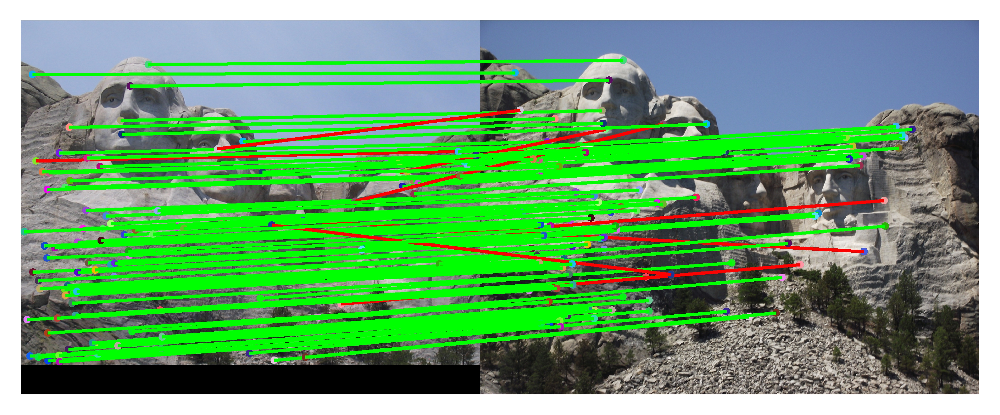
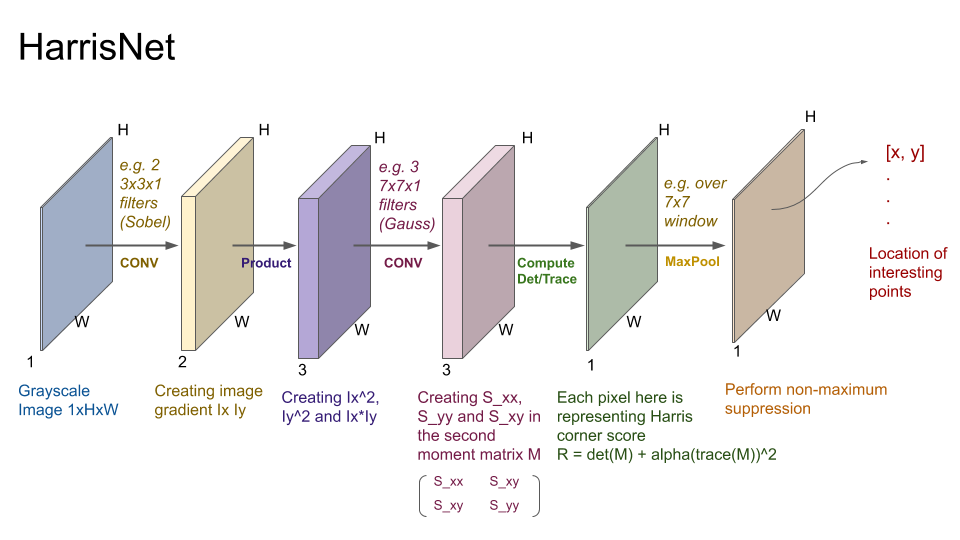
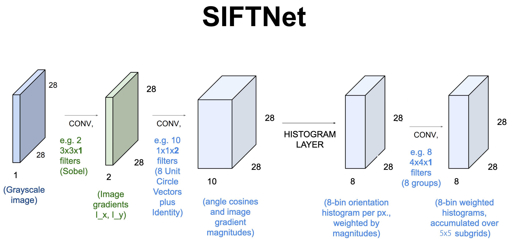

    
     
    The top 100 most confident local feature matches from an implementation of project 2. In this case, 92 were correct (lines shown in green) and 8 were incorrect (lines shown in red).
      

# Project 2: Local Feature Matching

## Brief
* Due:
  * 9/18/2019 11:59PM - Part 1 intermediate deliverable
  * 9/27/2019 11:59PM - Entire project (the final score for your HarrisNet implementation will be an average of your HarrisNet in the 9/18 and 9/27 submissions)
* Project materials including writeup template [proj2_v3.zip](projects/proj2_v3.zip)
* Hand-in: through [Canvas](https://gatech.instructure.com)
* Required files:
  * Intermediate: `HarrisNet.py`
  * Final: `<your_gt_username>.zip`, `<your_gt_username>_proj2.pdf`

## Overview
The goal of this assignment is to create a local feature matching algorithm using techniques described in Szeliski chapter 4.1. The pipeline we suggest is based on a simplified version of the famous SIFT pipeline. However, we will not be implementing this in the classical fashion. We will be implementing it as though it were part of a neural network. The matching pipeline is intended to work for instance-level matching -- multiple views of the same physical scene.

This project is intended to further familiarize you with Python, PyTorch, and local feature matching. Once again, you may find these resources helpful. Python: [here](https://docs.python.org/3/tutorial/). PyTorch: [here](https://pytorch.org/tutorials/).

## Setup
Note that the same environment used in project 1 can be used for this project!!! If you already have a working environment, just activate it and you are all set, no need to redo these steps! If you run into import module errors, try "pip install -e ." again, and if that still doesn't work, you may have to create a fresh environment.

1. Install [Miniconda](https://conda.io/miniconda.html). It doesn't matter whether you use Python 2 or 3 because we will create our own environment that uses 3 anyways.
2. Create a conda environment using the appropriate command. On Windows, open the installed "Conda prompt" to run the command. On MacOS and Linux, you can just use a terminal window to run the command, Modify the command based on your OS (`linux`, `mac`, or `win`): `conda env create -f proj2_env_<OS>.yml`
3. This should create an environment named 'proj2'. Activate it using the Windows command, `activate proj2` or the MacOS / Linux command, `source activate proj2`
4. Install the project package, by running `pip install -e .` inside the repo folder.
5. Run the notebook using `jupyter notebook ./proj2_code/proj2.ipynb`
6. Ensure that all sanity checks are passing by running `pytest unit_tests` inside the repo folder.
7. Generate the zip folder for the code portion of your submission once you've finished the project using `python zip_submission.py --gt_username <your_gt_username>` (don't forget to submit your report, too!).

## Part 1: HarrisNet

    
     
    Overview of HarrisNet pipeline
      

The original Harris corner detector is described in the lecture materials and Szeliski 4.1.1. See Algorithm 4.1 in the textbook for pseudocode. You do not need to worry about scale invariance or keypoint orientation estimation for your baseline Harris corner detector. The original paper by Chris Harris and Mike Stephens describing their corner detector can be found [here](http://www.bmva.org/bmvc/1988/avc-88-023.pdf). We will be implementing the Harris detector using a Neural Network - HarrisNet. Our network has 5 layers (all of which you will have to implement), described briefly below:

* **ImageGradientsLayer** - retrieves image gradients in each direction. This layer is already implemented for you, but you'll need to implement `get_sobel_xy_parameters()` in `torch_layer_utils.py` for it to work.
* **ChannelProductLayer** - returns product between channel of the previous layer $$I_{xx}$$, $$I_{yy}$$ and $$I_{xy}$$.
* **SecondMomentMatrixLayer** - computes Second Moment Matrix.
* **CornerResponseLayer** - computes the R cornerness matrix over the entire image.
* **NMSLayer** - performs non-maxima suppression to keep only the strongest corners in local regions.

After passing images through the entire network, we still need to extract specific coordinates as our interest points, which is done in `get_interest_points()` (you will implement this) in `HarrisNet.py`.

## Part 2: SIFTNet

    
     
    Overview of SIFTNet pipeline
      

You will implement a SIFT-like local feature based on the lecture materials and Szeliski 4.1.2. We will be implementing Sift using a neaural network - SIFTNet. This network has 4 layers (which you will have to implement unless specified otherwise), described briefly below:
* **ImageGradientsLayer** - computes image gradients in each direction (already implemented for you).
* **SIFTOrientationLayer** - extracts gradient information along each orientation direction. In the original SIFT, we would be trying to find the contributions of our gradients to each orientation bin. Note that we can do this by trying to find the contribution of each gradient along each orientation vector, which is the same as finding the [projection](https://en.wikipedia.org/wiki/Vector_projection) of our gradients onto our orientation vectors. Recall that this can be done using dot products!
* **HistogramLayer** - creates weighted histograms over the entire image.
* **SubGridAccumulationLayer** - creates feature vectors that accumulate histograms from a region.

After passing images through the network we will have feature vectors over the entire image, but we need only want features from the specific interest point locations that we found. This will be done in `get_SIFTNet_features()` (you will implement this) in `SIFTNet.py`.

## Part 3: Feature Matching
You will implement the "ratio test" or "nearest neighbor distance ratio test" method of matching local features as described in the lecture materials and Szeliski 4.1.3. See equation 4.18 in particular. You will implement this in `student_feature_matching.py`. The potential matches that pass the ratio test the easiest should have a greater tendency to be correct matches--think about why.

## Data

We provide you with 3 pairs of pictures of the Notre Dame, Mt. Rushmore, and the Episcopal Palace(which we refer to as Gaudi). Each image in a pair is of the same object but from a slightly different viewpoint, and was taken under differing conditions. These images will be run through the entire local feature matching pipeline, first extracting interest points, then extracting features, and finally feature matching to get correspondences across images. The image at the top of the page is what the final evaluation looks like. Interest points are matched across images and correct ones (according to an annotated ground truth) are marked with green lines and incorrect with red. You are also free to test images of your own, you will just have to annotate them with a script we provide you with in the annotate_correspondences folder.

**Potentially useful NumPy Python library) or pytorch functions**: There are more details for these in each specific function header.

**Forbidden functions** (you can use these for testing, but not in your final code): anything that takes care of any of the main functions you've been asked to implement. If it feels like you're sidestepping the work, then it's probably not allowed. Ask the TAs if you have any doubts.

**Editing code**: You can use any method you want to edit the Python files. You may use a simple text editor like [Sublime Text](https://www.sublimetext.com/3), an IDE like [PyCharm](https://www.jetbrains.com/pycharm/), or even just editing the code in your browser from the iPython notebook homepage. Google "Python editor" to find a litany of additional suggestions.

## Testing
We have provided a set of tests for you to evaluate your implementation. We have included tests inside `proj2.ipynb` so you can check your progress as you implement each section. When you're done with the entire project, you can call additional tests by running `pytest unit_tests` inside the root directory of the project. _Your grade on the coding portion of the project will be further evaluated with a set of tests not provided to you._

## Bells & Whistles (Extra Points)
<u>Note that graduate students are required to have a solution that is within 30s per image pair using 4500 interest points (we use 4500 just as a way to check your time against ours).</u> Our solution took 10-15s under those conditions. Everyone else must be within 90s per image pair under those conditions.

**Suggestions**:
* up to 5 pts: The simplest thing to do is to experiment with the numerous SIFT parameters: How big should each feature be? How many local cells should it have? How many orientations should each histogram have? Different normalization schemes can have a significant effect as well. Don't get lost in parameter tuning though.
* up to 5 pts: Speeding up the entire pipeline to be faster than our solution.
* up to 5 pts: Annotating and testing on your own images (provide visualizations as well).
* up to 5 pts: Try the adaptive non-maximum suppression discussed in the textbook. Please implement this as a separate layer (i.e. write a new layer called `ANMSLayer` instead of implementing inside of `NMSLayer`)!

There is a max of 10 pts of extra credit for every student.

If you choose to do extra credit, make sure to include `README.txt` which briefly explains what you did, and how the TAs can run your code. Additionally, you should add slides _at the end_ of your report further explaining your implementation, results, and analysis. You will not be awarded credit if these two components (README and slides) are missing from your submission.

## Writeup
For this project (and all other projects), you must do a project report using the template slides provided to you. Do <u>not</u> change the order of the slides or remove any slides, as this will affect the grading process on Gradescope and you will be deducted points. In the report you will describe your algorithm and any decisions you made to write your algorithm a particular way. Then you will show and discuss the results of your algorithm. The template slides provide guidance for what you should include in your report. A good writeup doesn't just show results--it tries to draw some conclusions from the experiments. You must convert the slide deck into a PDF for your submission.

If you choose to do anything extra, add slides _after the slides given in the template deck_ to describe your implementation, results, and analysis. Adding slides in between the report template will cause issues with Gradescope, and you will be deducted points. You will not receive full credit for your extra credit implementations if they are not described adequately in your writeup.

## Rubric
* +35 pts: `HarrisNet` implementation in `HarrisNet.py` (the final score for this section will be an average of your implementations from the 9/18 and 9/27 submissions)
* +35 pts: `SIFTNet` implementation in `SIFTNet.py`
* +10 pts: Feature matching implementation in `student_feature_matching.py`
* +20 pts: Report with several examples of hybrid images
* -5\*n pts: Lose 5 points for every time you do not follow the instructions for the hand-in format.

## Submission Format
This is very important as you will lose 5 points for every time you do not follow the instructions. You will have two separate submissions on Canvas for this project:

* 9/18/2019 intermediate submission:
  1. `HarrisNet.py`
* 9/27/2019 final submission:
  1. `<your_gt_username>.zip` containing:
    * `proj2_code/` - directory containing all your code for this assignment (including `HarrisNet.py`!)
    * `additional_data/` - (optional) if you use any data other than the images we provide you, please include them here
    * `README.txt` - (optional) if you implement any new functions other than the ones we define in the skeleton code (e.g. any extra credit implementations), please describe what you did and how we can run the code. We will not award any extra credit if we can't run your code and verify the results.
  2. `<your_gt_username>_proj2.pdf` - your report

Do <u>not</u> install any additional packages inside the conda environment. The TAs will use the same environment as defined in the config files we provide you, so anything that's not in there by default will probably cause your code to break during grading. Do <u>not</u> use absolute paths in your code or your code will break. Use relative paths like the starter code already does. Failure to follow any of these instructions will lead to point deductions. Create the zip file using `python zip_submission.py --gt_username <your_gt_username>` (it will zip up the appropriate directories/files for you!) and hand it in with your PDF through Canvas.

## Credits
Assignment developed by Cusuh Ham, John Lambert, Patsorn Sangkloy, Vijay Upadhya, Samarth Brahmbhatt, Frank Dellaert, and James Hays based on a similar project by Derek Hoiem.
