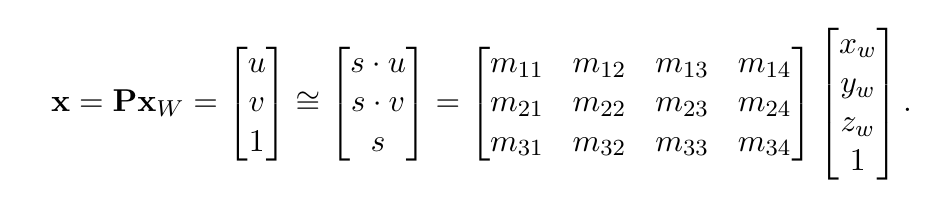
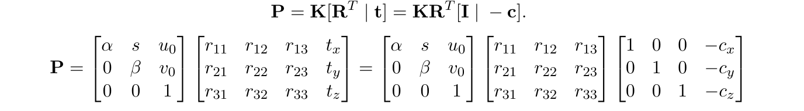
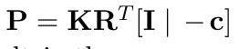
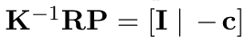
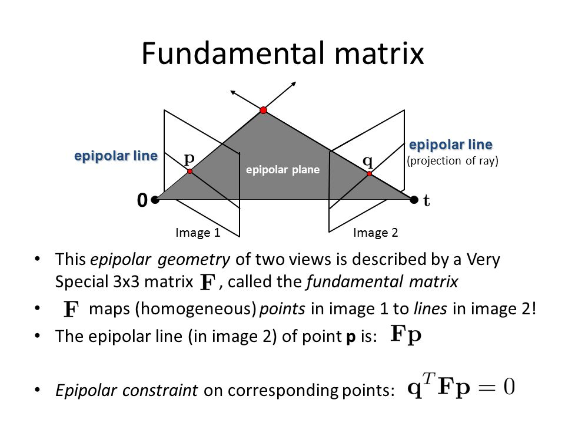

    
     
    Epipolar lines showing camera locations given corresponding points in two views of a scene.
      

# Project 3 - Camera Projection Matrix and Fundamental Matrix Estimation with RANSAC

## Brief
* Due:
  * 10/16/2019 11:59PM - Parts 1, 2, and 3
* Project materials including writeup template [proj3_0.zip](projects/proj3_0.zip)
* Hand-in: through [Canvas](https://gatech.instructure.com) AND [Gradescope](https://www.gradescope.com)
* Required files:
  * `<your_gt_username>.zip` on Canvas
  * `<your_gt_username>_proj2.pdf` on Gradescope

## Setup
Note that the same environment used in projects 1 and 2 can be used for this project!!! If you already have a working environment, just activate it and you are all set, no need to redo these steps! If you run into import module errors, try "pip install -e ." again, and if that still doesn't work, you may have to create a fresh environment.

1. Install [Miniconda](https://conda.io/miniconda.html). It doesn't matter whether you use Python 2 or 3 because we will create our own environment that uses 3 anyways.
2. Create a conda environment using the appropriate command. On Windows, open the installed "Conda prompt" to run the command. On MacOS and Linux, you can just use a terminal window to run the command, Modify the command based on your OS (`linux`, `mac`, or `win`): `conda env create -f proj2_env_<OS>.yml`
3. This should create an environment named 'proj2'. Activate it using the Windows command, `activate proj2` or the MacOS / Linux command, `source activate proj2`
4. Install the project package, by running `pip install -e .` inside the repo folder.
5. Run the notebook using `jupyter notebook ./proj2_code/proj2.ipynb`
6. Ensure that all sanity checks are passing by running `pytest unit_tests` inside the repo folder.
7. Generate the zip folder for the code portion of your submission once you've finished the project using `python zip_submission.py --gt_username <your_gt_username>` and submit to Canvas (don't forget to submit your report to Gradescope!).

## PART I - Camera Projection Matrix Estimation

**Learning Objective:** (1) Understanding the the camera projection matrix and estimating it (2) using fiducial objects for camera projection matrix estimation and pose estimation.

### Introduction
Estimating the geometry of a 3D scene, e.g. the position of the camera relative to a known object, can be done if the camera parameters are known. However, this is limited since from a single view scene structure and depth are inherently ambiguous. The importance of knowing camera parameters will become more clear in Part 2 where you will use multiple views. Recall that for a pinhole camera model, the camera matrix $$ P \in \mathbb{R}^{3\times4} $$ is a projective mapping from world (3D) to pixel (2D) coordinates defined up to a scale

    
     
      

The camera matrix can also be decomposed into intrinsic parameters $$ \mathbf{K} $$ and extrinsic paramters $$ \mathbf{R}^T[\mathbf{I}\;|\; -\mathbf{c}] $$.

    
     
      

Let's look more carefully into what each of the individual parts of the decomposed matrix mean. The homogenous vector coordinates $$ (x_w, y_w, z_w,1) $$ of $$ \mathbf{x}_W $$ indicate the position of a point in 3D space in the *world* coordinate system. The matrix $$ [\mathbf{I}\;|\; -\mathbf{c}] $$ represents a translation and the matrix $$ \mathbf{R}^T $$ represents a rotation, when combined they convert points from the world to the camera coordinate system. An intuitive way to understand this is to think about how aligning the axes of the world coordinate system to the ones of the camera coordinate system can be done with a rotation and a translation.

    
     
    Distinction between camera coordinate and world coordinate systems is a rotation and a translation
      

In this part of the project you will learn how to estimate the projection matrix using objective function minimization, how you can decompose the camera matrix and what knowing these lets you do.

### Part 1.1 Estimating the Projection Matrix
A camera projection matrix maps points from 3D into 2D. How can we use this to estimate its parameters? Assume that we have $$ N $$ known 2D-3D correspondences for a set of points, that is, for $$ S=s_1, s_2, \dots, s_N $$ we have both access to their respective 3D coordinates $$ \mathbf{x}_W^{i} $$ and 2D coordinates $$ \mathbf{x}^{i} $$. Let $$ \tilde{\mathbf{P}} $$ be an estimation for the camera projection matrix. We can determine how accurate the estimation is by measuring the *reprojection error* $$ \sum_{i=1}^N ||\tilde{\mathbf{P}}\mathbf{x}_W^i-\mathbf{x}^i ||_2 $$ between the 3D points projected into 2D $$ \tilde{\mathbf{P}}\mathbf{x}_W^i $$ and the known 2D points $$ \mathbf{x}^i $$. Therefore we can estimate the projection matrix itself by minimizing the reprojection error with respect to the projection matrix $$
\underset{\tilde{\mathbf{P}}}{\arg\min}\sum_{i=1}^N ||\tilde{\mathbf{P}}\mathbf{x}_W^i-\mathbf{x}^i ||_2 . $$
You will implement a function *reprojection(x)* that takes as input camera parameters as a vector, loads point correspondences, performs projection given *x* and outputs the reprojection error.

Note: Since $$ \mathbf{P} $$ is defined up to scale, in order to perform this minimization you will need to set $$ \mathbf{P}_{3,4}=1 $$.
### Part 1.2 Decomposing the Projection Matrix
Recall that 
$$ \mathbf{P} =\mathbf{K}\mathbf{R}^T[\mathbf{I}\;|\; -\mathbf{c}].$$
Rewriting this gives us 
$$ \mathbf{P} =[\mathbf{K}\mathbf{R}^T\;|\; \mathbf{K}\mathbf{R}^T -\mathbf{c}] = [\mathbf{M}\;|\; \mathbf{M}-\mathbf{c}]. $$
Where $$ \mathbf{M} = \mathbf{K}\mathbf{R}^T $$ is the first 3 columns of $$ \mathbf{P} $$. We will provide you code that will perform an operation called \textit{RQ decomposition} which will decompose $$ \mathbf{M} $$ into an upper triangular matrix $$ \mathbf{R} $$ and an orthonormal matrix $$ \mathbf{Q} $$ such that $$ \mathbf{RQ} = \mathbf{M} $$, where the upper triangular matrix will correspond to $$ \mathbf{K} $$ and the ortonormal matrix to $$ \mathbf{R}^T $$. In this part of the project you will need to get the appropriate matrix elements of $$ \mathbf{P} $$ to perform the RQ decomposition, which will be code provided by us.

### Part 1.3 -- Camera Matrix Estimation in Practice
In parts 1.1 and 1.2 you were given a set of known points in world coordinates. In this part of the assignment you will learn how to use a fiducial---an object of known size that can be used as a reference. Any object for which you have measured the size given some unit (in this project you should use centimeters).

    
     
    Example of how one cuboid of known dimensions can be used as a fiducial to create multiple world coordinate systems
      

Figure 1 illustrates how a cuboid of known dimension can be used to create a world coordinate system and a set of points with known 3D location. Choose an object that you will use as a fiducial (we recommend using a thick textbook) and measure it. Using a camera capture an image of the object. Now that you have the dimension of your object (3D points) you can use the (appropriate place in the IPython notebook) to find the image coordinates of the 3D points create your own 2D - 3D correspondences for each image. For each of your 3 images, using your code from parts 1.1 and 1.2 you should be able to estimate the camera position relative to the world coordinate frame you chose, and then visualize this in the IPython notebook. When taking the image, try to estimate the position of the camera lens on your phone in the world coordinate system in the same units you used to measure the book.

  * In part 1.2 you decomposed the camera matrix into $$ \mathbf{KR^T} $$. How can we use this decomposition to estimate the camera center? Since  this implies that , therefore the last column of this result is the camera center $$ -\mathbf{c} $$. Using this derivation will implement a function *find_camera_center* that takes as input a projection matrix $$ \mathbf{P} $$ and outputs the camera center in world coordinates.
 * Using your initial guess for the location of the camera lens, you will also implement a unit test that will test whether your estimated camera position is within a sphere of 5cm radius from your calculated camera center $$ -\mathbf{c} $$
 * What would happen to the projected points if you increased/decreased the $$ x $$ coordinate, or the other coordinates of the camera center? Write down a description of your expectations. Perform this shift for each of the camera coordinates and then recompose the projection matrix and visualize the result in your IPython notebook. Was the visualized result what you expected?

## PART II - Fundamental Matrix Estimation
Now that we know how to project a point from a 3D coordinate to a 2D coordinate, next we’ll look at how to map corresponding 2D points from two images of the same scene. In this part, given a set of corresponding 2D points, we will do calculations to estimate the fundamental matrix. You can think of the fundamental matrix as something that projects points from one scene onto a line in the other scene. The fundamental matrix projects onto a line because a point in one image is only defined up to a scale, which means we can’t actually know the “depth” of that point. As such, from the viewpoint of the other camera, we can see the entire “line” that our first point could exist on.

    
     
    https://www.google.com/url?sa=i&source=images&cd=&ved=2ahUKEwiU2vzK2-fkAhXtguAKHSyBDUsQjRx6BAgBEAQ&url=https%3A%2F%2Fslideplayer.com%2Fslide%2F5279455%2F&psig=AOvVaw2QZO15Ap6vXFMJPvnjtGZg&ust=1569354563277107      

The fundamental matrix is defined by the following equation:

    
     
      

Where F is the matrix and the two vectors (u, v, 1) and (u’, v’, 1) represent the homogeneous coordinates of our points on our images. (Note: the fundamental matrix is sometimes defined as the transpose of the above matrix with the left and right image points swapped. Both are valid fundamental matrices, but we assume you use the one above.)

You can think of the fundamental matrix as a **transformation** that takes points in one image and maps them to a line in another image. The reason why we want to solve for F such that the equation above is 0 is because ideally we want to end up with two orthogonal lines. We want the vector represented by F[u, v, 1] to be orthogonal to [u’, v’, 1]^T. In other words, we want the fundamental matrix to transform our points [u, v, 1] to a line that is perpendicular to the line that includes the other set of points. This is also like saying that we want the line, F multiplied by [u, v, 1], to be as close to point [u’, v’, 1] as possible.

As such, we want to **minimize** the error of our projection from a point to a line. This makes estimating the fundamental matrix an optimization problem.

We will give you a set of n points, and with each point, you can set up the equation
$$
d(q, Fp)^2 + d(p, qF)^2
$$

where $$ d $$ represents the distance, or the error, between line $$ Fp $$ and point $$ q $$, and we add that to the squared-error between line $$ qF $$ and point $$ p $$. We can do this for n pairs of points and create an objective function representing the sum of squares of these errors across all the points:
$$ 
J(F) = \sum_{i}^n d(q, Fp)^2 + \sum_{i}^n d(p, qF)^2
$$
In order to calculate the distance d, we use the following equation:
$$
d = {|a(x_0) + b(y_0) +c|}/\sqrt{a^2 + b^2}
$$
https://brilliant.org/wiki/dot-product-distance-between-point-and-a-line/

where [a, b, c] represent the line $$ Fp $$ or $$ qF $$, and [x0, y0] represent the coordinates of your points.

In your code, you need to implement the *symmetric_line_to_point_distances* method that calculates the metric that we want to minimize while optimizing for the fundamental matrix. You will also need to call the *optimize* function to actually optimize for the fundamental matrix.

After you are able to estimate the fundamental matrix with the points we give you, next you will be trying out the fundamental matrix on images that you take and corresponding points that you collect.

Take your own images of the same scene of a book, save them as “image_p.jpg” and “image_q.jpg”

Run *get_points.py* to plot your own points and export “p.txt” and “q.txt” files with your collected points.

Run *python fundamental_matrix.py image_p.jpg image_q.jpg p.txt q.txt* to calculate your own fundamental matrix and visualize your epipolar lines.

You’ll need to take a screenshot of this and put it in your report later.

## Part III: RANSAC
Now you have a function which can calculate the fundamental matrix $$F$$ from matching pairs of points in two different images. However, having to manually extract the matching points is undesirable. In the previous project, we implemented SIFTNet to automate the process of identifying matching points in two images. Below is a high-level description of how we will implement this section. See the *jupyter notebook* and code stubs for implementation details.

We will implement a pipeline to run two images through SIFTNet to extract matching points and then send those points to your fundamental matrix estimation function to acheive an automated process for generating the fundamental matrix $$F$$. However, there is an issue with this. Previously, the manually identified points were perfect matches between your two images. However, as we saw before, SIFT does not generate matches with 100% accuracy. Fortunately, to calculate the fundamental matrix $$F$$ we need only 9 matching points and SIFT can generate hundreds, so there should be more than enough good matches somewhere in there, if only we can find them.

We will use a method called RANdom SAmple Consensus (RANSAC) to search through the points returned by SIFT and find true matches to use for calculating the fundamental matrix $$F$$. Please review the [lecture slides](schedule.html) on RANSAC to refresh your memory on how this algorithm works. Additionally, you can find a simple explanation of RANSAC at [https://www.mathworks.com/discovery/ransac.html](https://www.mathworks.com/discovery/ransac.html]) See section 6.1.4 in the textbook for a more thorough explanation of how RANSAC works.

In summary, we will implement a workflow using the SIFTNet from project 2 to extract feature points, then RANSAC will select a random subset of those points, you will call your function from part 2 to calculate the fundamental matrix $$F$$ for those points, and then you will check how many other points identified by SIFTNet match $$F$$. Then you will iterate through this process until you find the subset of points that produces the best fundamental matrix $$F$$ with the most matching points.
