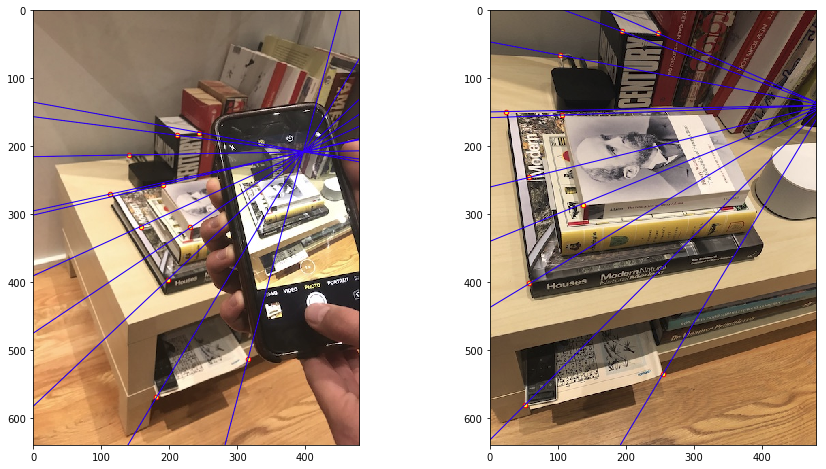
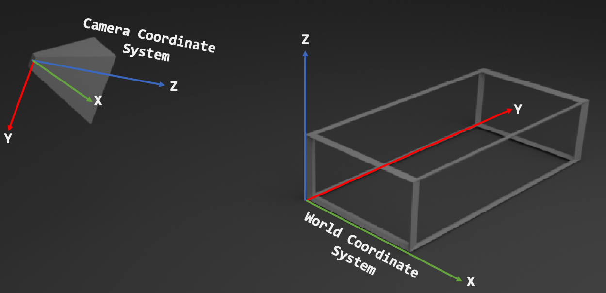
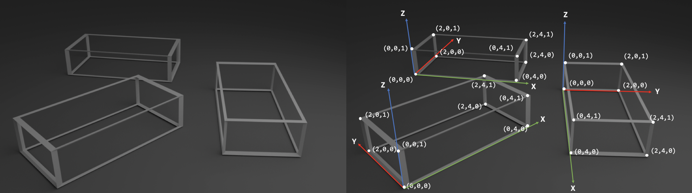

    
     
    Epipolar lines showing camera locations given corresponding points in two views of a scene.
      

# Project 3 - Camera Projection Matrix and Fundamental Matrix Estimation with RANSAC

## Brief
* Due:
  * 10/16/2019 11:59PM - Parts 1, 2, and 3
* Project materials including writeup template [proj3_0.zip](projects/proj3_0.zip)
* Hand-in: through [Canvas](https://gatech.instructure.com) AND [Gradescope](https://www.gradescope.com)
* Required files:
  * `<your_gt_username>.zip` on Canvas
  * `<your_gt_username>_proj2.pdf` on Gradescope

## Setup
Note that the same environment used in projects 1 and 2 can be used for this project!!! If you already have a working environment, just activate it and you are all set, no need to redo these steps! If you run into import module errors, try "pip install -e ." again, and if that still doesn't work, you may have to create a fresh environment.

1. Install [Miniconda](https://conda.io/miniconda.html). It doesn't matter whether you use Python 2 or 3 because we will create our own environment that uses 3 anyways.
2. Create a conda environment using the appropriate command. On Windows, open the installed "Conda prompt" to run the command. On MacOS and Linux, you can just use a terminal window to run the command, Modify the command based on your OS (`linux`, `mac`, or `win`): `conda env create -f proj2_env_<OS>.yml`
3. This should create an environment named 'proj2'. Activate it using the Windows command, `activate proj2` or the MacOS / Linux command, `source activate proj2`
4. Install the project package, by running `pip install -e .` inside the repo folder.
5. Run the notebook using `jupyter notebook ./proj2_code/proj2.ipynb`
6. Ensure that all sanity checks are passing by running `pytest unit_tests` inside the repo folder.
7. Generate the zip folder for the code portion of your submission once you've finished the project using `python zip_submission.py --gt_username <your_gt_username>` and submit to Canvas (don't forget to submit your report to Gradescope!).

## PART I - Camera Projection Matrix Estimation

**Learning Objective:** (1) Understanding the the camera projection matrix and estimating it (2) using fiducial objects for camera projection matrix estimation and pose estimation.

### Introduction
In this first part you will perform pose estimation in an image taken by an uncalibrated camera. Pose estimation is incredibly useful, as we saw in class: it is used in VR, AR, controller tracking, autonomous driving, and even satellite docking. Recall that for a pinhole camera model, the camera matrix $$ P \in \mathbb{R}^{3\times4} $$ is a projective mapping from world (3D) to pixel (2D) coordinates defined up to a scale.

$$
\begin{align}
\mathbf{x} = f(\mathbf{X}_w;\mathbf{P}) = \mathbf{P}\mathbf{X}_w =
\begin{bmatrix}
    u \\
    v \\
    1
\end{bmatrix}
\cong
\begin{bmatrix}
    s \cdot u \\
    s \cdot v \\
    s
\end{bmatrix}
=
\begin{bmatrix}
p_{11} & p_{12} & p_{13} & p_{14} \\
p_{21} & p_{22} & p_{23} & p_{24} \\
p_{31} & p_{32} & p_{33} & p_{34} \\
\end{bmatrix}
\begin{bmatrix}
    x_w \\
    y_w \\
    z_w \\
    1
\end{bmatrix}.
\end{align}
$$

Above $$s$$ is an arbitrary scale factor. The camera matrix can also be decomposed into intrinsic parameters $$\mathbf{K}$$ and extrinsic parameters $$\mathbf{R}^T\left[\mathbf{I}\mid -\mathbf{t}  \right]$$.

$$\mathbf{P} = \mathbf{K}\mathbf{R}^T[\mathbf{I}\;|\; -\mathbf{t}].$$

$$
\mathbf
{P}=
\begin{bmatrix}
    \alpha & s & u_0 \\
    0 & \beta & v_0 \\
    0 & 0 & 1
\end{bmatrix}
\begin{bmatrix}
r_{11} & r_{12} & r_{13} \\
r_{21} & r_{22} & r_{23} \\
r_{31} & r_{32} & r_{33}
\end{bmatrix}
\begin{bmatrix}
1 & 0 & 0 & t_x \\
0 & 1 & 0 & t_y \\
0 & 0 & 1 & t_z
\end{bmatrix}
$$

Let's look more carefully into what each of the individual parts of the decomposed matrix mean. The homogenous vector coordinates $$(x_w, y_w, z_w,1)$$ of $$\mathbf{X}_w$$ indicate the position of a point in 3D space in the *world* coordinate system. The matrix $$[\mathbf{I}\;\mid\; -\mathbf{t}]$$ represents a translation and the matrix $$\mathbf{R}^T$$ represents a rotation, when combined they convert points from the world to the camera coordinate system. An intuitive way to understand this is to think about how aligning the axes of the world coordinate system to the ones of the camera coordinate system can be done with a rotation and a translation.

    
     
    Distinction between camera coordinate and world coordinate systems is a rotation and a translation
      

In this part of the project you will learn how to estimate the projection matrix using objective function minimization, how you can decompose the camera matrix and what knowing these lets you do.

### Part 1.1 -- Implement Camera Projection

In `student_code.py` you will implement camera projection in the `projection(P, points_3d)` from homogenous world coordinates $$X_i = [X_i, Y_i, Z_i, 1]$$ to non-homogenous image coordinates $$x_i, y_i$$.

Given the projection matrix $$\mathbf{P}$$, the equation that accomplish this are:

$$
\begin{align}
x_i = \frac{p_{11}X_i+p_{12}Y_i + p_{13}Z_i + p_{14}}{p_{31}X_i+p_{32}Y_i + p_{33}Z_i + p_{34}} \quad y_i = \frac{p_{21}X_i+p_{22}Y_i + p_{23}Z_i + p_{24}}{p_{31}X_i+p_{32}Y_i + p_{33}Z_i + p_{34}}.
\end{align}
$$

### Part 1.2 -- Implement Objective Function

A camera projection matrix maps points from 3D into 2D. How can we use this to estimate its parameters? Assume that we have $$ N $$ known 2D-3D correspondences for a set of points, that is, for points with index $$ i= 1\dots N $$ we have both access to the respective 3D coordinates $$ \mathbf{x}_w^{i} $$ and 2D coordinates $$ \mathbf{x}^{i} $$. Let $$ \hat{\mathbf{P}} $$ be an estimation for the camera projection matrix. We can determine how accurate the estimation is by measuring the *reprojection error* 

$$ \sum_{i=1}^N (\hat{\mathbf{P}}\mathbf{x}_w^i-\mathbf{x}^i )^2 $$

between the 3D points projected into 2D $$ \hat{\mathbf{P}}\mathbf{x}_w^i $$ and the known 2D points $$ \mathbf{x}^i $$, both in **non-homogenous** coordinates. Therefore we can estimate the projection matrix itself by minimizing the reprojection error with respect to the projection matrix 

$$\underset{\hat{\mathbf{P}}}{\arg\min}\sum_{i=1}^N (\hat{\mathbf{P}}\mathbf{x}_w^i-\mathbf{x}^i )^2 . $$

In this part, in `student_code.py` you will implement the objective function `objective_function()` that will be passed to `scipy.optimize.least_squares` for minimization with the Levenberg-Marquardt algorithm. 

### Part 1.3: -- Estimating the Projection Matrix Given Point Correspondences
Optimizing the reprojection loss using Levenberg-Marquardt requires a good initial estimate for $$\mathbf{P}$$. This can be done by having good initial estimates for $$\mathbf{K}$$ and $$\mathbf{R}^T$$ and $$\mathbf{t}$$ which you can multiply to then generate your estimated $$\mathbf{K}$$. In this part, to make sure that you have the least squares optimization working properly we will provide you with an initial estimate. In the function you will have to implement in this part, `estimate_projection_matrix()`, you will have to pass the initial guess to `scipy.optimize.least_squares` and get the appropriate output. 

Note: because $$P$$ has only 11 degrees of freedom, we fix $$\mathbf{P}_{34=1}$$.
### Part 1.4 -- Decomposing the Projection Matrix
Recall that 
$$ \mathbf{P} =\mathbf{K}{}_w\mathbf{R}^T_c[\mathbf{I}\;|\; -{}_w\mathbf{t}_c].$$
Rewriting this gives us

$$ \mathbf{P} =[\mathbf{K}{}_w\mathbf{R}^T_c\;|\; \mathbf{K}{}_w\mathbf{R}^T_c -{}_w\mathbf{t}_c] = [\mathbf{K}{}_c\mathbf{R}_w\;|\; \mathbf{K}{}_c\mathbf{t}_w] = [\mathbf{M}\;|\; \mathbf{K}{}_c\mathbf{t}_w]. $$

Where $$ \mathbf{M} = \mathbf{K}{}_c\mathbf{R}_w $$ is the first 3 columns of $$ \mathbf{P} $$. An operation known as *RQ decomposition* which will decompose $$ \mathbf{M} $$ into an upper triangular matrix $$ \mathbf{R} $$ and an orthonormal matrix $$ \mathbf{Q} $$ such that $$ \mathbf{RQ} = \mathbf{M} $$, where the upper triangular matrix will correspond to $$ \mathbf{K} $$ and the ortonormal matrix to $$ {}_c\mathbf{R}_w $$. In this part you will implement `decompose_camera_matrix(P)` where you will need to get the appropriate matrix elements of $$ \mathbf{P} $$ to perform the RQ decomposition, and make the appropriate function call to `scipy.linalg.rq()`.

### Part 1.5 -- Calculating the Camera Center

In this part in `student_code.py` you will implement `calculate_camera_center(P, K, R)` that takes as input the
projection $$\mathbf{P}$$, intrinsic $$\mathbf{K}$$ and rotation $${}_c\mathbf{R}_w$$ matrix and outputs the camera position in world coordinates. 

### Part 1.6: -- Taking Your Own Images and Estimating the Projection Matrix + Camera Pose

In part 1.3 you were given a set of known points in world coordinates. In this part of the assignment you will learn how to use a fiducial---an object of known size that can be used as a reference. Any object for which you have measured the size given some unit (in this project you should use centimeters).

    
     
    Example of how one cuboid of known dimensions can be used as a fiducial to create multiple world coordinate systems
      

The figure above illustrates how a cuboid of known dimension can be used to create a world coordinate system and a set of points with known 3D location. Choose an object that you will use as a fiducial (we recommend using a thick textbook) and measure it. Using a camera capture two images of the object (you will estimate the camera parameters for both images) keeping in mind the considerations discussed in class for part 2 and fundamental matrix estimation if you want to reuse these images. When taking the images, try to estimate the pose of the camera lens of your phone in the world coordinate system.

Now that you have the dimension of your object (3D points) you can use the  the IPython notebook to find the image coordinates of the 3D points create your own 2D - 3D correspondences for each image. For each of your 2 images, make initial estimates for $$\mathbf{P}$$ and if your estimate is good, using your code from the previous part you should be able to estimate both the the projection matrix and the camera pose, and use the code available in the IPython notebook to visualize your findings.

### Report
* What would happen to the projected points if you increased/decreased the $$ x $$ coordinate, or the other coordinates of the camera center $$\mathbf{t}$$? Write down a description of your expectations in the appropriate part of your writeup submission.
* Perform this shift for each of the camera coordinates and then recompose the projection matrix and visualize the result in your IPython notebook. Was the visualized result what you expected?

## PART II - Fundamental Matrix Estimation

**Learning Objective:** (1) Understanding the fundamental matrix and estimating it (2) using self capturedd images to estimate your own fundamental matrix 

In this part, given a set of corresponding 2D points, we will estimate the **fundamental matrix**. Now that we know how to project a point from a 3D coordinate to a 2D coordinate, next we’ll look at how to map corresponding 2D points from two images of the same scene. You can think of the fundamental matrix as something that maps points from one view into a line in the other view. We get a line because a point in one image is only *a projection* to 2D,  which means we can’t actually know the “depth” of that point. As such, from the viewpoint of the other camera, we can see the entire “line” that our first point could exist on.

The **fundamental matrix constraint** between two points $$x_0$$ and $x_1$ in the left and right views, respectively, is given by the following equation

$$x_0^TFx_1=0$$

Above $$x_0$$ and $$x_1$$ are *homogenous coordinates$ in the two views, and $$F$$ is the $$3 \times 3$$ fundamental matrix. FYI we can write out the equation above as:

$$
\begin{bmatrix}
u_0           &           v_0           &           1
\end{bmatrix}
\begin{bmatrix}
f_{11}          &           f_{12}          &           f_{13}\\
f_{21}          &           f_{22}          &           f_{23}\\
f_{31}          &           f_{32}          &           f_{33}\\
\end{bmatrix}
\begin{bmatrix}
u_1\\
v_1\\
1
\end{bmatrix}
=0
$$

Snce $$F$$ takes points in one image and maps them to a line in another image, the constraint says that we want the point $$x_0$$ to be on the *line* represented by $$Fx_1$$. If the point is exactly on the line, then the constraint $$x^T_1Fx_1=0$$ and the **line-to-point** distance between them is also zero.

Hence to estimate $$F$$ we can minmize the line-to-point distance between the point $$x_0$$ and the line $$Fx_1$$, for all matching points $$(x_0, x_1)$$. This makes estimating the fundamental matrix a **least squares problem**.

### Part 2.1 -- Distance Formula
The **line-to-point distance** formula $$d$$ is defined by the following equation

$$
d(l, x) = \frac{au + bv + c}{\sqrt{a^2 + b^2}}
$$

Where $$ 1 = [a,b,c]$$ is a line and $$x = [u, v, 1]$$ is the homogenous coordinate for the point. You will need to implement this in `point_line_distance()` in `student_code.py`.

### Part 2.2 -- Symmetric line-to-point error
Given a set of matching points $$\{x_0^i, x_1^i\}$$ we can set up the following symmetric line-to-point error function for every match $$(x_0,x_1)$$.

$$
d(Fx_1, x_0)^2 + d(F^T x_0, x_1)^2
$$

where $$d$$ is the distance formula between a line and a point, $$x_0$$ is one of the homogeneous points, $$F$$ is the fundamental matrix, and $$x_1$$ is the other homogeneous point. Above, in the first term we use $$F$$ which maps from the second to the first view, and in second term we use $$F^T$$ which maps from the first to the second view.

By applying this symmetric line-to-point error calculation to every pair of points, we get this equation for the objective function to minimize, as a function of $$F$$:

$$
J(F) = \sum_i^n \bigg( d(Fx_1^i, x_0^i)^2 + d(F^T x_0^i, x_1^i)^2 \bigg)
$$

This is the equation you will be implementing in `signed_point_line_errors()` which is in the file `student_code.py`jj.

### Part 2.3 -- Least Squares Optimization

Since this is a least squares optimization, you will also be making the call to SciPy's least squares optimizer. The documentation for this is available [here](https://docs.scipy.org/doc/scipy/reference/generated/scipy.optimize.least\_squares.html).
You'll need to give as input the objective function, your initial estimate of the fundamental matrix, optimization algorithm, method for computing the Jacobian, and the point pairs. There are more details on this in the code files.

### Part 2.4 -- Try it Yourself

Similar to Part I, for this part, you'll have to take two images of the same scene and estimate the fundamental matrix between the two images. Recall that these two images must be from different positions, and you cannot simply just rotate the camera or zoom the image. You'll have to save the images in the same project folder and use the jupyter notebook to run your fundamental matrix estimator on your images.

## Report 

* Why is it that when you take your own images, you can't just rotate the camera or zoom the image for your two images of the same scene?
* Why is it that points in one image are projected by the fundamental matrix onto epipolar *lines* in the other image?
* What happens to the epipoles and epipolar lines when you take two images where the camera centers are within the images? Why?
* What does it mean when your epipolar lines are all horizontal across the two images?
* Why is the fundamental matrix defined up to a scale?
* Why is the fundamental matrix rank 2?

## Part III: RANSAC
Now you have a function which can calculate the fundamental matrix $$F$$ from matching pairs of points in two different images. However, having to manually extract the matching points is undesirable. In the previous project, we implemented SIFTNet to automate the process of identifying matching points in two images. Below is a high-level description of how we will implement this section. See the *jupyter notebook* and code stubs for implementation details.

We will implement a pipeline to run two images through SIFTNet to extract matching points and then send those points to your fundamental matrix estimation function to acheive an automated process for generating the fundamental matrix $$F$$. However, there is an issue with this. Previously, the manually identified points were perfect matches between your two images. However, as we saw before, SIFT does not generate matches with 100% accuracy. Fortunately, to calculate the fundamental matrix $$F$$ we need only 9 matching points and SIFT can generate hundreds, so there should be more than enough good matches somewhere in there, if only we can find them.

We will use a method called RANdom SAmple Consensus (RANSAC) to search through the points returned by SIFT and find true matches to use for calculating the fundamental matrix $$F$$. Please review the [lecture slides](schedule.html) on RANSAC to refresh your memory on how this algorithm works. Additionally, you can find a simple explanation of RANSAC at [https://www.mathworks.com/discovery/ransac.html](https://www.mathworks.com/discovery/ransac.html]) See section 6.1.4 in the textbook for a more thorough explanation of how RANSAC works.

In summary, we will implement a workflow using the SIFTNet from project 2 to extract feature points, then RANSAC will select a random subset of those points, you will call your function from part 2 to calculate the fundamental matrix $$F$$ for those points, and then you will check how many other points identified by SIFTNet match $$F$$. Then you will iterate through this process until you find the subset of points that produces the best fundamental matrix $$F$$ with the most matching points.
