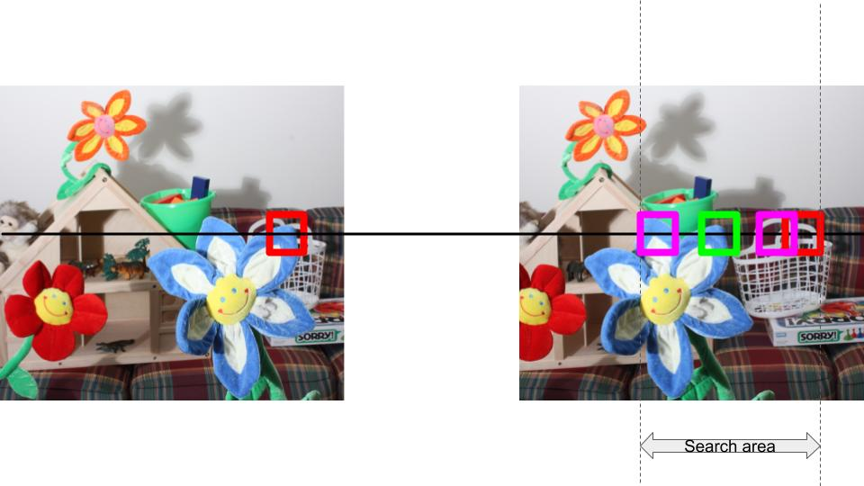
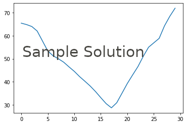
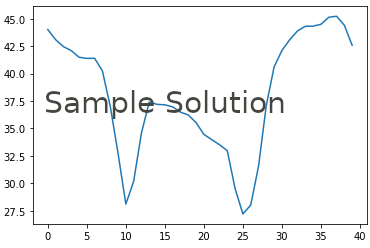

# [Project 4: Depth Estimation using Stereo](proj4.md)
# Part 1: Simple stereo by matching patches
We know that there is some encoding of depth when the images are captured using a stereo rig, much like human eyes.

You can try a simple experiment to see the stereo effect in action. Try seeing a scene with only your left eye. Then close your left eye and see using your right eye. Make the transition quickly. You should notice a _horizontal_ shift in the image perceived. Can you comment on the difference in shift for different objects when you do this experiment? Is it related to the depth of the objects in some way?

In this notebook, we will generate _disparity maps_, which is the map of horizontal shifts estimated at each pixel. We will start working on a simple algorithm which will then be evolved to give better disparity maps.

The notebook to be used for this part is `simple_stereo.ipynb`.

## Random dot stereogram
It was once believed that in order to perceive depth, one must either match feature points (like SIFT) between left and right images, or rely upon cues such as shadows.

A random dot stereogram eliminates all other depth cues and hence it proves that a stereo setup is sufficient to get an idea of the depth of the scene.

A random dot stereogram is generated by the follow steps:
1. Create the left image with random dots at each pixel (0/1 values).
2. Create the right image as the copy of left image.
3. Select a region in the right image and shift it horizontally.
4. Add a random pattern in the right image in the empty region created after the shift.

You will implement these steps in the function `generate_random_stereogram()` in `utils.py`. A corresponding unit test is defined in `test_utils.py`.

Please read the documentation carefully.

### Reflection questions
1. What do you think of the random dot stereogram? Can you judge the depth by looking at the images?

## Similarity measure
We will use a similarity function to compare patches between left and right images. We will implement two similarity functions:
1. Sum of squared differences (SSD): $$ SSD(A, B) = \sum_{i,j}(A_{ij} - B_{ij})^2 $$
2. Sum of absolute differences (SAD): $$ SAD(A, B) = \sum_{i,j}\lvert A_{ij}-B_{ij}\lvert $$

You will implement these functions in `similarity_measures.py`. The corresponding unit tests are defined in `test_similarity_measures.py`.

## Disparity Maps
We are now ready to write the code for a simple algorithm for stereo matching.

    
     
    Example of a stereo algorithm.
      

These are the steps taken in this image (and will be implemented by you):

1. Pick a patch in the left image (red block), P1.
2. Place the patch in the same (x,y) coordinates in the right image (red block). As this is binocular stereo, we will need to search for P1 on the left side starting from this position. Make sure you understand this point well before proceeding further.
3. Slide the block of candidates to the right (indicated by the different pink blocks). The search area is restricted by the parameter `max_search_bound` in the code. The candidates will overlap.
4. We will pick the candidate patch with the minimum similarity error (green block). The horizontal shift from the red block to the green block in this image is the disparity value for the centre of P1 in the left image.

Note: the images have already been rectified and hence we can search on just a horizontal scan line.

The function works as follows:
* Input:
    1. Left image
    2. Right image
    3. Similarity function
    4. Patch size
    5. Max_search_value
* Output:
    1. Disparity map

Implement this in `disparity_map.py` (please read the documentation carefully!). The corresponding unit tests are defined in `test_disparity_map.py`.

## Observations and analysis

### Random stereogram image
1. What is the effect of increasing the block size?
2. Why is the result poor on the left edge and not on the other edges?

### Error profile analysis
In the error profile analysis, you have to find two examples which display convex and non-convex error profile respectively. For reference, these are the plots we obtained:

    
     
    Convex profile
      
    
     
    Non-convex profile
      

### Natural images
The questions for stereo on natural images are in the notebook. It is advisable to read through all the examples and questions before starting to answer them.

### Smoothing
The questions for smoothing are in the notebook, along with an overview of smoothing. Before running this section, you will need to implement calculate_cost_volume() in disparity_map.py. The details for his are in the notebook as well as the code, but it will build off of your disparity map implementation. 

## Credit
All images in this section have been used from the [Middlebury stereo dataset](http://vision.middlebury.edu/stereo/data/).
