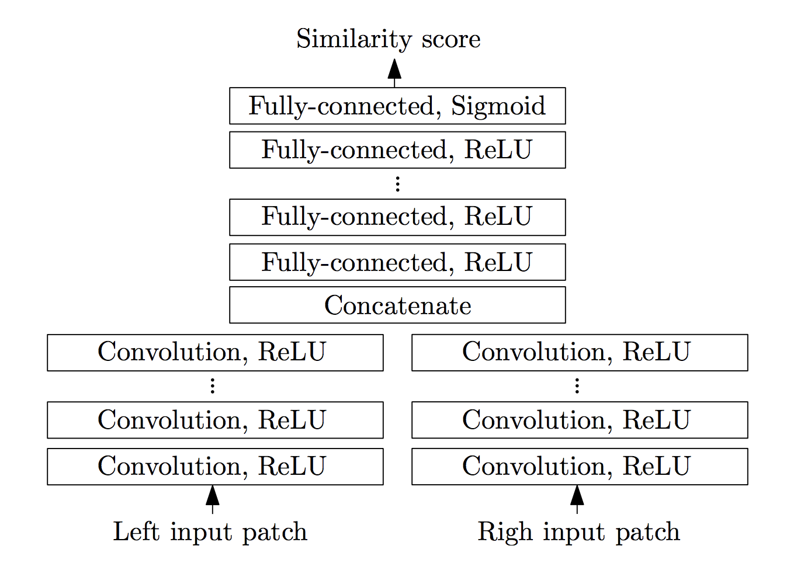

# Project 4 (2019): Depth estimation using Stereo

## Part 2: Learning based stereo matching
In the previous parts, you saw how we can use simple concepts like SAD and SSD to compute matching costs between two patches and produce disparity maps. Now let's try something different: instead of using SAD or SSD to measure similarity, we will train a neural network and learn from the data directly.   

## Setup

For this part, we will be using [Google Colab]([https://colab.research.google.com](https://colab.research.google.com/)), which is a cloud based jupyter notebook environment. You can choose to run this part locally as well, especially if you have a good GPU, but the assignment is designed to run on Colab with GPU. You'll first need to upload `proj4_code/mc-cnn.ipynb` to [Google Colab]([https://colab.research.google.com](https://colab.research.google.com/)) first, then you'll be able to run them the same way you run any other notebook.

In Colab, make sure you select GPU in the menu "Runtime" -> "Change runtime time" -> "Hardward accelerator" 

### Overview
You'll be implementing what has been proposed in the paper [[Zbontar & LeCun, 2015]](https://arxiv.org/abs/1409.4326) and evaluating/seeing how it performs compared to classical cost matching approaches. The paper proposes several network architectures, but what we will be using is the `accurate` architecture for [Middlebury stereo dataset](http://vision.middlebury.edu/stereo/data/). This dataset provides ground truth disparity map for each stereo pair, which means we know exactly where the match is supposed to be on the epipolar line. This allows us to extract many many such matches and train the network to identify what type of patches should be matched and what shouldn't. You should definitely read the paper in more detail if you are curious about how it works.

You don't have to worry about the dataset, we provide those in a ready-to-use format (with rectification). In fact, you won't be doing much coding in this part. Rather, you should focus on experimenting and thinking about *why*. Your written report will have a lot of weight in this part, so try to be as clear as possible.

To be more specific, your tasks in this part is to

 - Implement the network architecture as described in the paper. See **Network Architecture** section for more details. 
 - Implement a simple function to extract patch from an image. This is pretty straightforward. See the instruction on the notebook for more details. 
 - Train a neural network. Tune the training parameters until you get the best results (lowest loss) on the validation set.     
	 - Experiment with the learning rate: try using large (> 1) vs small value (< 1e-5). What difference does it make? Why?   
	 - Experiment with the optimizer: try using Adam vs SGD as optimizer. Do you see any difference?   
	 - Pick the best combination of hyperparameters with the lowest validation loss. You should show the training loss plot in the report. You'll get full points in this part if your final validation loss is below 0.3.
 - Experiment with different architectures and describe how it effects the training. 
     - Implement function that extends an existing model with an additional layer. Don't forget to include the appropriate non-linearities!
     - What happens when you add layers like a fully connected layer to the architecture? Provide plots of the training loss and compare the validation loss to the original model.
     - What happens when you use different window sizes for matching? How does window size affect the quality of the results? Using the pretrained networks provided fine-tune the original architectures with the different window sizes and compare the average error results from the different window sizes. Report on how long you trained.
 - Evaluate with the metrics used in the [Middlebury leaderboard for stereo matching.](http://vision.middlebury.edu/stereo/eval3/) For the bicycle image, you should see the improvement in using the trained network vs SAD matching cost.
	 - ***avgerr*** : average absolute error in pixels *(lower is better)*
	 - ***bad1*** : percentage of bad pixels whose error is greater than 1 *(lower is better)*
	 - ***bad2*** : percentage of bad pixels whose error is greater than 2 *(lower is better)*
	 - ***bad4*** : percentage of bad pixels whose error is greater than 4 *(lower is better)*

The disparity map can take a long time to generate since we are now using a neural network instead of a simple SSD/SAD function to measure similarity, it can take up to 1 hour on Colab. We suggest you start early and don't run it last minute. You'll only need to show us one disparity map of your best network, see the report template for more details.

Also note that while we're closely following the proposed matching cost network from the paper, we are still skipping several bells and whistles post processing components used in the paper, so the results are still far from perfect. You are free to add any components you think would be useful (doesn't have to be from the paper). There is a maximum of **10 Pts extra credit** for any interesting extra experiment outside of the outline we have. Be creative, and be clear and concise about what extra things you did in the report (we won't be running your code for this, but we will have 1 page in the report for you to show off your cool experiment). Here are some starting points:
- Experiment with the window size (currently we are using 11x11 patch size). Larger block size will give you larger context, at the expense of computational cost. 
- Data augmentation for the training. Rather than cropping patches directly, you can augment the data with slight rotation/affine transformations to make it more robust to noise and perspective change. Be careful not to transform too much that we lost the precision of the match. To earn extra credit, you must explain the augmentation you do, and show the improvement of before and after adding it. 
- Experiment with fine tuning vs training from scratch. Inspect the rate at which the loss is going down, and which one is faster to converge. Give some general examples of when should you fine tune from a pre-trained network vs when should you train from scratch.     


### Network architecture



The inputs to the network are 2 image patches, coming from left and right images, each will pass through a series of convolution + ReLU layers. The extracted features are then concatenated and passed through another fully connected + ReLU layers. The output is a single real number between 0 and 1, indicating the similarity between the two input images [Zbontar & LeCun, 2015] 

In this case, since training from scratch will take a really long time to converge, you'll be training from our pre-trained network instead. In order to load up the pre-trained network, you must first implement the architecture exactly as described here.

| Hyperparameter |  |
|--|--|
| input_patch_size | 11x11 |
| num_conv_layers | 5 |
| num_conv_feature_maps | 112 |
| conv_kernel_size | 3 |
| num_fc_layers | 3 |
| num_fc_units | 384 |

For efficiency we will convolve both input images in the same batch (this means that the input to the network will be 2xbatch_size). After the convolutional layers, we will then reshape them into (batch_size, conv_out) where `conv_out` is the output size of the convolutional layers. This will then be passed through a series of fully connected layers and finally a Sigmoid layer to bound the output value to 0/1.

Here is the example of such network with num_conv_layers = 1 and num_fc_layers = 2:

```
nn.Sequential(
            nn.Conv2d(in_channel, num_feature_map, kernel_size=kernel_size, stride=1, padding=(kernel_size//2)),
            nn.ReLU(),

            Reshape((batch_size,conv_out)), #this is a custom layer provided in the notebook which will reshape the input into the specified size

            nn.Linear(conv_out,num_hidden_unit),
            nn.ReLU(),
            nn.Linear(num_hidden_unit,1),
            nn.Sigmoid(),
            )
```

