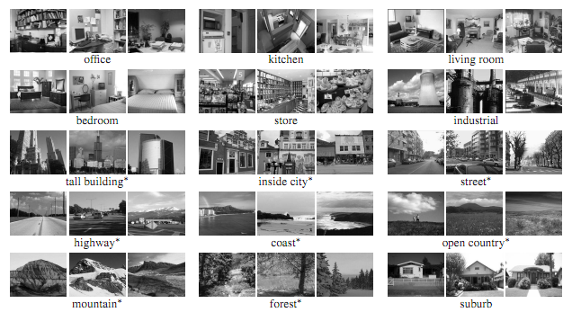

# Project 6: Scene Recognition with Deep Learning

## Brief
* Due: 12/02/2019 11:59PM
* Project materials including writeup template [proj6.zip](projects/proj6_v1.zip)
* Data to be used: [data.zip](projects/data_proj5.zip): **Note that this is the same dataset you have been using for Project 5**. Download and extract to the project folder, or simply copy from your project 5. **IMPORTANT**: After you have copied the dataset, swap the names of the `train` and `test` folder, i.e., the default `train` folder should be `test`, and the other is `train` (the default `test` folder contains more images, and we want to make sure you have more images for training).
* Hand-in: through [Canvas](https://gatech.instructure.com) AND [Gradescope](https://www.gradescope.com)
* Required files:
  * `<your_gt_username>.zip` on Canvas
  * `<your_gt_username>_proj6.pdf` on Gradescope

## Setup

Take note that some of the concepts used in this project have **NOT** been covered in lectures, hence you may want to use this instruction page as the reference material when you proceed to each section.

We will be installing a **NEW** environment for this project; follow the instructions below to set up the env. If you run into import module errors, try “pip install -e .” again, and if that still doesn’t work, you may have to create a fresh environment.

Note that although we are training a neural net from scratch for this project, your laptop should be sufficient to handle this (expecting a 5 to 10 minutes training time for Part 1 and 2, and roughly 20 to 30 minutes for Part 3 with only the CPU); you are free to use Google Colab on this, but you may need to figure out a way of putting both the notebook and the dataset into your Google Drive and mount it in the Colab notebook (this [tutorial](https://www.marktechpost.com/2019/06/07/how-to-connect-google-colab-with-google-drive/) covers everything you need to know to set it up).

1. Install [Miniconda](https://conda.io/miniconda.html). It doesn't matter whether you use Python 2 or 3 because we will create our own environment that uses 3 anyway.
2. Create a conda environment using the appropriate command. On Windows, open the installed "Conda prompt" to run the command. On MacOS and Linux, you can just use a terminal window to run the command, Modify the command based on your OS (`linux`, `mac`, or `win`): `conda env create -f proj6_env_<OS>.yml`
3. This should create an environment named 'proj6'. Activate it using the Windows command, `activate proj6` or the MacOS / Linux command, `source activate proj6`
4. Install the project package, by running `pip install -e .` inside the repo folder.
5. Run the notebook using `jupyter notebook proj6.ipynb`
6. Ensure that all sanity checks are passing by running `pytest` inside the "proj6_unit_tests/" folder.
7. Generate the zip folder for the code portion of your submission once you've finished the project using `python zip_submission.py --gt_username <your_gt_username>` and submit to Canvas (don't forget to submit your report to Gradescope!).

## Dataset:
The dataset to be used in this assignment is the 15-scene dataset, containing natural images in 15 possible scenarios like bedrooms and coasts. It's first introduced by [Lazebnik et al, 2006](https://www.di.ens.fr/willow/pdfs/cvpr06b.pdf). The images have a typical size of around 200 by 200 pixels, and serve as a good milestone for many vision tasks. A sample collection of the images can be found below:

    
     
    Example scenes from each of the categories of the dataset.
      

## Part 1: A SimpleNet: Dataset, Model, and Trainer
**Learning Objective:** (1) Understanding the rationale behind data pre-processing, (2) construct a basic Convolutional Neural Net for multi-class classification, (3) understand the use of some basic layers used in neural net, and (4) set up the training workflow in PyTorch.

### Introduction

In the last project, scene recognition with bag of words, we created the classification model using some old-school machine learning techniques like bag-of-words model and kNN. You have seen your test accuracy ranging from 45% to possibly 60%, if you have done something extra like applying a SVM classifier and fine-tuned your parameters. Now we are tending to the same problem using deep learning (and easily beat those traditional models!).

In this part, we are going to train a simple convolutional neural net from scratch. We'll be starting with some modification to the dataloader used in this project to include a few extra pre-processing steps. Subsequently, you will define your own model and optimization function. A trainer class will be provided to you, and you will be able to test out the performance of your model with this complete pipeline of classification problem.

### Part 1.1: Datasets, Dataloader, and Data Transforms

In this part you'll be implementing the basic Datasets object, which helps to retrieve the data from your local data folder, and prepare to be used by your model. To start with, finish the `compute_mean_and_std()` function in `stats_helper.py` and compute the mean and standard deviation of the dataset. Check out the relevant function in [sklearn](https://scikit-learn.org/stable/modules/generated/sklearn.preprocessing.StandardScaler.html) which might be helpful for this; you may probably want to use the function `partial_fit` here. **Note** that here we want to compute the mean and standard deviation for **all pixels across all images** after you have normalized each image to the range [0, 1], hence when you apply `partial_fit`, your feature dimension should be 1 and the returning mean and standard deviation should both be a single value. Think about how you can achieve this by reshaping the input to the `scaler`.

Next, fill in the `ImageLoader` class in `image_loader.py`. Note that similar to what you have implemented in Project 1, here the `ImageLoader` class contains the paths to the dataset images, and should be able to return the expected element given an index. More details can be found in the file.

Additionally, in `data_transforms.py`, complete the function `get_fundamental_transforms()`: resize the input, convert it to a tensor, and normalize it using the passed in mean and standard deviation. You may find `torchvision.transforms.Resize`, `torchvision.transforms.ToTensor`, `torchvision.transforms.Normalize`, and `torchvision.transforms.Compose` useful here, and it should only take a few lines of code.

### Part 1.2: SimpleNet: Model

Now open the `simple_net.py` and fill in the model definition. By now you should have a decent grasp on how to properly define a deep learning model using `nn.Conv2d`, `nn.ReLU`, `nn.MaxPool2d`, etc. For this part, define a convolutional neural network with **2** conv layers (and the corresponding ReLU, MaxPool, and Fully Connected layers) which aligns with our training dataset (15 classes). Below you may find a sample network architecture which is sufficient to get you pass Part 1.

    
     
    Example architecture you may try in Part 1.
      

After you have defined the proper model, now fill in the `forward` function, which accepts the input (a batch of images), and generates the output classes (this should only take a couple of lines of code).

### Part 1.3: SimpleNet: Trainer

We have provided you with a basic trainer (check out the `runner.py`) where we'll load in the dataset and train the network you have defined for some epochs. To complete this section, first assign proper values to the dict `optimizer_config` in the Jupyter notebook with reasonable **learning rate** and **weight decay**, and then fill in the `optimizer.py` with the default optimization function `Adam`.

Next, in `dl_utils.py`, complete `predict_labels()` and `compute_loss()`, where you are given an input model, and calculate the corresponding predictions and loss respectively; these functions will be used in the training process later.

Lastly, train it using the starter code in Jupyter Notebook, and report the training process according to the report. Take note that you may use these values ("lr" and "weight_decay") as a starting point to tune your parameters to pass this part.

You should be able to achieve a 50% accuracy with ease. Note how the performance is different from Project 5: previously you have defined a bunch of visual vocabulary and spent at least half an hour to see a decent 45% accuracy using bags-of-words model; here a couple of lines of code for a 2 layer neural net have easily defeated that!

Note that although you are **NOT** required to modify anything in the `runner.py`, it is still highly recommended to read through the code and understand how to properly define the training process, as well as record the loss history.

### Experiment and Report:
For Part 1, note that you are required to get a final validation accuracy of **50%** to receive full credits.

## Part 2: Overfitting

**Learning Objective:** (1) Understanding the effects and cause of **overfitting**, (2) learn about the basic techniques to avoid overfitting, (3) understand the common data augmentation and transforms used in PyTorch, and (4) apply the concept of **dropout** in the network.

### Introduction

If you have been examining the performance from the previous section, like loss and accuracy, you will notice that our training accuracy is somewhere around **98~100%**, if you have implemented everything correctly. By contrast, the threshold for passing Part 1 is a **50%** accuracy of the testing data; this difference is often regarded as "overfitting": the model performs much better on the training data, but is not able to generalize well on data it has never seen previously. Normally, 2 reasons lead to this effect:

1. **Data**: If you have examined the dataset, you'll notice that the number of images used for training totals at around 3000; this could be a relatively small number considering we have 15 classes together; can we do better? There are some real-life scenarios where we could get some insights: if you left-right flip (mirror) an image of a scene, it never changes categories. A kitchen doesn't become a forest when mirrored. This isn't true in all domains -- a "d" becomes a "b" when mirrored, so you can't "jitter" digit recognition training data in the same way. But we **CAN** synthetically increase our amount of training data by left-right mirroring training images during the learning process in this particular project.

2. **Model**: We have trained our model to fit well with the training data, but obviously it's doing "too well". To counter this, we are going to use a technique called "dropout" to regularize the network. What does dropout regularization do? It randomly turns off network connections at training time to fight overfitting. This prevents a unit in one layer from relying too strongly on a single unit in the previous layer. Dropout regularization can be interpreted as simultaneously training many "thinned" versions of your network. At test time all connections are restored, which is analogous to taking an average prediction over all of the "thinned" networks.

### Part 2.1: Jitter, Random Flip and Normalization

Open the `data_transforms.py`: you'll find some starter code where the data input is cropped in the center and then transformed into a tensor. Add another 2 data transformations in the function `get_data_augmentation_transforms()`, where you could jitter the data, and randomly flip the data left-to-right. You may find the methods `transforms.RandomHorizontalFlip()` and `transforms.ColorJitter()` helpful in this part. Pay attention to the **position** where you insert those transforms!

### Part 2.2: Dropout Layer
Open the `simple_net_dropout.py`, and first copy your existing "SimpleNet" model into this file, and then append a dropout layer in the model. You may use the default dropout probability from `nn.Dropout()` for regularization.

With the new data augmentation and dropout added into the model, let's re-run the trainer and check its performance. Follow the template code used in the notebook, and train the "regularized" network with the new data transforms. You should be seeing that compared with Part 1, your training accuracy drops but testing accuracy improves.

### Experiment and Report:
For Part 2, note that you are required to get a final testing accuracy of **55%** to receive full credits. Similar to Part 1, you may need to start with some optimization configuration values in the Jupyter notebook, and gradually tune it for better performance. Also, take a screenshot of what you have done in `get_data_augmentation_transforms()`, and put it inside the report.

## Part 3: AlexNet

**Learning Objective:** (1) Understanding the rationale of **deep** learning, (2) learn to utilize pretrained models defined by PyTorch, (3) understand the concept of fine-tuning, and (4) achieve good classification results with the help of pretrained model weights.

### Introduction

Ever since 2012, deep learning has been extremely successful in vision related tasks, and everything blows up from a model named **AlexNet**.

Training a relatively complex model like AlexNet completely from scratch is sometimes overwhelming, especially when GPU is not available. However, PyTorch has already incorporated the pretrained weights of some famous model and provide you with the option of loading it directly.

### Part 3.1: AlexNet Model Definition

Now switch to `my_alexnet.py`, and first load the AlexNet using `model=torchvision.models.alexnet(pretrained=True)`.

Note that in the original AlexNet model, there are **1000** output classes, while we have 15 for this project. Remember in project 4 where you have retrieved some layers from an existing network, and concatenate them with your own custom layers? Here we are going to do the same thing: in `simple_net.py`, when you have obtained the AlexNet model, retrieve the convolutional layers (which helps you to detect the features) and the fully connected layers (which generates the classification scores), remove the last Linear layer, and replace it with a proper layer which could output the scores for 15 classes. You may find `module.children()` helpful here.

### Part 3.2: Fine-tuning AlexNet

Notice that what we have done is merely defining the final layer with the correct dimensions, but the weights of the layer are just some random values and it won't be able to produce the desired scores. In the Jupyter Notebook, follow the starter code and train the newly defined network. Note that AlexNet has **millions** of parameters, so training it from scratch could cause problems for your laptop with no GPU support, hence here we are only training it for 5 epochs and the expected running time is around 20 minutes without a GPU. In addition, note that you do **NOT** need to update the weights for earlier layers of the model, therefore, **freeze** the weights of the convolution layers and **some** of the fully connected layers of the model (think about which FC layers to freeze by printing out the model architecture), and then train the network following the template code in the notebook, observe the performance and answer the questions in the report. You may find `weight.requires_grad` and `bias.requires_grad` helpful here.

### Experiment and Report:
For Part 3, note that you are required to get a final testing accuracy of **85%** to receive full credits.

## Extra Credits

SimpleNet:

* Up to 4 pts: In Part 2, modify the network architecture and achieve a final testing accuracy of **63%**; note that you are **NOT** allowed to add more `nn.Conv2d` into the model; instead, think about how to improve the model with a concept called "batch normalization".

AlexNet and beyond:

* Up to 4 pts: Fine-tune your AlexNet and reach a testing accuracy of 93%.
* Up to 6 pts: Fine-tune another network like `torchvision.models.resnet`, and reach a testing accuracy of 90%.

## Writeup
For this project (and all other projects), you must do a project report using the template slides provided to you. Do <u>not</u> change the order of the slides or remove any slides, as this will affect the grading process on Gradescope and you will be deducted points. In the report you will describe your algorithm and any decisions you made to write your algorithm a particular way. Then you will show and discuss the results of your algorithm. The template slides provide guidance for what you should include in your report. A good writeup doesn't just show results--it tries to draw some conclusions from the experiments. You must convert the slide deck into a PDF for your submission.

If you choose to do anything extra, add slides _after the slides given in the template deck_ to describe your implementation, results, and analysis. Adding slides in between the report template will cause issues with Gradescope, and you will be deducted points. You will not receive full credit for your extra credit implementations if they are not described adequately in your writeup.

## Rubric

* +70 pts: Code
  * 20 pts: Part 1
  * 20 pts: Part 2
  * 30 pts: Part 3
* +30 pts: PDF report
  * 8 pts: Part 1
  * 10 pts: Part 2
  * 12 pts: Part 3
* -5\*n pts: Lose 5 points for every time you do not follow the instructions for the hand-in format.

## Submission Format
This is very important as you will lose 5 points for every time you do not follow the instructions. You will have two submission files for this project:

1. `<your_gt_username>.zip` via **Canvas** containing:
* `proj6_code/` - directory containing all your code for this assignment
2. `<your_gt_username>_proj6.pdf` via **Gradescope** - your report

Do <u>not</u> install any additional packages inside the conda environment. The TAs will use the same environment as defined in the config files we provide you, so anything that's not in there by default will probably cause your code to break during grading. Do <u>not</u> use absolute paths in your code or your code will break. Use relative paths like the starter code already does. Failure to follow any of these instructions will lead to point deductions. Create the zip file using `python zip_submission.py --gt_username <your_gt_username>` (it will zip up the appropriate directories/files for you!) and hand it through Canvas. Remember to submit your report as a PDF to Gradescope as well.

## Credit
Assignment developed by Ayush Baid, Cusuh Ham, Jonathan Balloch, Shenhao Jiang, Frank Dellaert, and James Hays.
